<!--
  This is your PROFILE README. It goes in a repo named exactly after your
  username (e.g. github.com/OCTOCAT/OCTOCAT) so GitHub shows it on your profile.
-->

  <picture>
    <source media="(prefers-color-scheme: dark)" srcset="portrait.svg">
    <source media="(prefers-color-scheme: light)" srcset="portrait.svg">
    
  </picture>
  <picture>
    <source media="(prefers-color-scheme: dark)" srcset="info-card.svg">
    <source media="(prefers-color-scheme: light)" srcset="info-card.svg">
    
  </picture>

## Yash A

**Full Stack Developer**

 

<!-- animated contribution graph, refreshed daily by the workflow -->
<picture>
  <source media="(prefers-color-scheme: dark)" srcset="contrib-heatmap.svg">
  <source media="(prefers-color-scheme: light)" srcset="contrib-heatmap.svg">
  
</picture>

